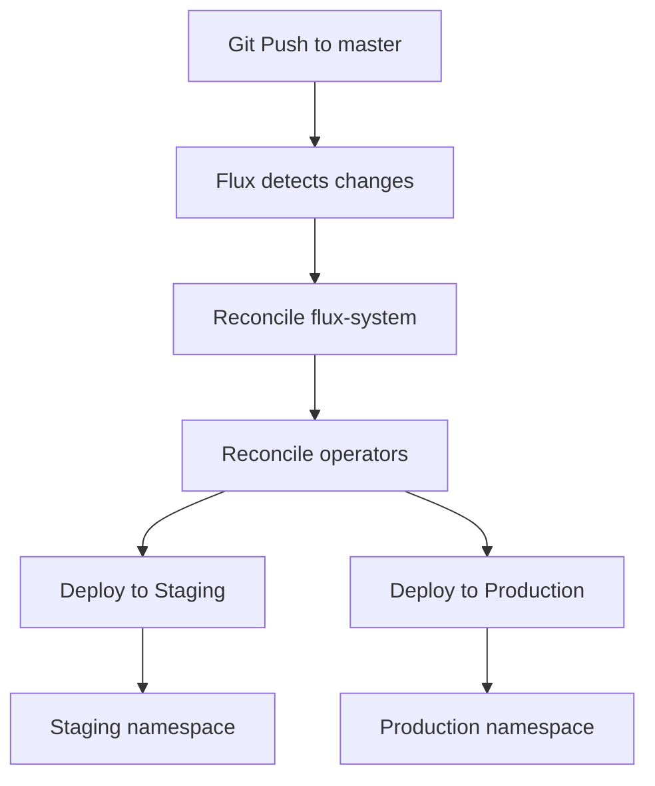

# FluxCD GitOps Configuration

This directory contains all FluxCD configurations for GitOps-based deployment of the Task Manager application.

## 📁 Directory Structure

```
flux/
├── apps/
│   ├── base/                    # Base configuration (shared)
│   │   ├── helmrelease.yaml     # Base HelmRelease template
│   │   └── kustomization.yaml   # Base kustomization
│   │
│   ├── staging/                 # Staging environment overlay
│   │   ├── values-patch.yaml    # Staging-specific values
│   │   └── kustomization.yaml   # Staging kustomization
│   │
│   └── production/              # Production environment overlay
│       ├── values-patch.yaml    # Production-specific values
│       └── kustomization.yaml   # Production kustomization
│
├── operators/
│   ├── cloudnative-pg.yaml      # PostgreSQL operator
│   ├── cert-manager-issuer.yaml # TLS certificate issuer
│   └── kustomization.yaml       # Operators kustomization
│
└── clusters/production/
    └── flux-kustomizations.yaml # Root Flux configuration
```

---

## 🎯 Base + Overlays Pattern

This configuration uses the **Kustomize Base + Overlays** pattern - an industry best practice that follows the DRY (Don't Repeat Yourself) principle.

### How It Works

1. **Base** (\pps/base/\): Contains common configuration shared across all environments
2. **Overlays** (\pps/staging/\, \pps/production/\): Contains environment-specific patches

### Benefits

- ✅ **No Code Duplication**: Common config defined once
- ✅ **Easy Maintenance**: Changes in base apply to all environments
- ✅ **Clear Differences**: Overlays show exactly what differs per environment
- ✅ **Scalable**: Easy to add new environments

---

## 📋 Base Configuration

### \apps/base/helmrelease.yaml\

Defines the base HelmRelease with common values:

```yaml
spec:
  values:
    app:
      image:
        repository: ghcr.io/kingmetok/task-manager-k8s
        tag: "latest"
      ingress:
        enabled: true
        className: nginx
    postgresql:
      enabled: true
    dragonfly:
      enabled: true
```

### \pps/base/kustomization.yaml\

```yaml
apiVersion: kustomize.config.k8s.io/v1beta1
kind: Kustomization
resources:
  - helmrelease.yaml
```

---

## 🟦 Staging Overlay

### Configuration

- **Namespace**: \staging\
- **Replicas**: 1 (fixed)
- **Resources**: Minimal (512Mi RAM, 500m CPU)
- **Database**: 1 PostgreSQL instance
- **Cache**: 1 Dragonfly replica
- **Autoscaling**: Disabled
- **Domain**: \	ask-manager-staging.127.0.0.1.sslip.io\

### \apps/staging/values-patch.yaml\

Patches applied on top of base configuration:

```yaml
spec:
  releaseName: task-manager-staging
  targetNamespace: staging
  values:
    app:
      replicaCount: 1
      resources:
        requests:
          cpu: 100m
          memory: 256Mi
        limits:
          cpu: 500m
          memory: 512Mi
      autoscaling:
        enabled: false
    postgresql:
      instances: 1
    dragonfly:
      replicas: 1
```

### \apps/staging/kustomization.yaml\

```yaml
apiVersion: kustomize.config.k8s.io/v1beta1
kind: Kustomization
namespace: flux-system
resources:
  - ../base
namePrefix: staging-
patches:
  - path: values-patch.yaml
    target:
      kind: HelmRelease
      name: task-manager
```

---

## 🟩 Production Overlay

### Configuration

- **Namespace**: \production\
- **Replicas**: 2-5 (HPA-managed)
- **Resources**: Production-grade (1Gi RAM, 1000m CPU)
- **Database**: 3 PostgreSQL instances (High Availability)
- **Cache**: 2 Dragonfly replicas (High Availability)
- **Autoscaling**: Enabled (CPU 70%, Memory 80%)
- **Domain**: \	ask-manager-production.127.0.0.1.sslip.io\

### \apps/production/values-patch.yaml\

```yaml
spec:
  releaseName: task-manager-production
  targetNamespace: production
  values:
    app:
      replicaCount: 2
      resources:
        requests:
          cpu: 200m
          memory: 512Mi
        limits:
          cpu: 1000m
          memory: 1Gi
      autoscaling:
        enabled: true
        minReplicas: 2
        maxReplicas: 5
        targetCPUUtilizationPercentage: 70
        targetMemoryUtilizationPercentage: 80
    postgresql:
      instances: 3  # High Availability
    dragonfly:
      replicas: 2   # High Availability
```

---

## 🔧 Operators

### CloudNativePG Operator

Manages PostgreSQL databases using the CloudNativePG operator.

```yaml
# operators/cloudnative-pg.yaml
apiVersion: source.toolkit.fluxcd.io/v1
kind: HelmRepository
metadata:
  name: cloudnative-pg
  namespace: flux-system
spec:
  interval: 1h
  url: https://cloudnative-pg.github.io/charts
---
apiVersion: helm.toolkit.fluxcd.io/v2
kind: HelmRelease
metadata:
  name: cloudnative-pg
  namespace: flux-system
spec:
  chart:
    spec:
      chart: cloudnative-pg
      version: "0.22.1"
```

### cert-manager Issuer

Provides self-signed TLS certificates for Ingress.

```yaml
# operators/cert-manager-issuer.yaml
apiVersion: cert-manager.io/v1
kind: ClusterIssuer
metadata:
  name: selfsigned-issuer
spec:
  selfSigned: {}
```

---

## 🚀 Deployment Flow



### Reconciliation Order

1. **flux-system** - Core Flux components
2. **operators** - CloudNativePG, cert-manager
3. **staging** - Staging environment (depends on operators)
4. **production** - Production environment (depends on operators)

---

## 📊 Environment Comparison

| Feature | Base | Staging Patch | Production Patch |
|---------|------|---------------|------------------|
| **Image** | ghcr.io/kingmetok/task-manager-k8s:latest | ← | ← |
| **Replicas** | - | 1 (fixed) | 2-5 (HPA) |
| **CPU Limit** | - | 500m | 1000m |
| **Memory Limit** | - | 512Mi | 1Gi |
| **PostgreSQL** | enabled: true | 1 instance | 3 instances (HA) |
| **Dragonfly** | enabled: true | 1 replica | 2 replicas (HA) |
| **Autoscaling** | - | disabled | enabled |
| **Ingress** | enabled: true | staging domain | production domain |

---

## 🔄 Flux Commands

### Check Status

```bash
# Check Flux health
flux check

# View all Flux resources
flux get all

# View HelmReleases
flux get helmreleases -A

# View Kustomizations
flux get kustomizations -A
```

### Force Reconciliation

```bash
# Reconcile Git repository
flux reconcile source git flux-system

# Reconcile specific kustomization
flux reconcile kustomization staging
flux reconcile kustomization production

# Reconcile specific HelmRelease
flux reconcile helmrelease -n flux-system staging-task-manager
flux reconcile helmrelease -n flux-system production-task-manager
```

### Suspend/Resume

```bash
# Suspend (pause automation)
flux suspend kustomization staging

# Resume
flux resume kustomization staging
```

---

## 🛠️ Troubleshooting

### HelmRelease Failed

```bash
# Check HelmRelease status
kubectl describe helmrelease -n flux-system staging-task-manager

# Check Helm controller logs
kubectl logs -n flux-system deploy/helm-controller --tail=100
```

### Kustomization Failed

```bash
# Check Kustomization status
kubectl describe kustomization -n flux-system staging

# Check Kustomize controller logs
kubectl logs -n flux-system deploy/kustomize-controller --tail=100
```

### Self-Healing Not Working

```bash
# Check if Flux is watching the resource
flux get kustomizations -A

# Force reconciliation
flux reconcile kustomization staging --with-source
```

---

## 📖 Additional Resources

- [Flux Documentation](https://fluxcd.io/docs/)
- [Kustomize Documentation](https://kustomize.io/)
- [CloudNativePG Documentation](https://cloudnative-pg.io/)
- [cert-manager Documentation](https://cert-manager.io/docs/)

---

## ✅ Validation

Before committing changes to this directory:

1. Validate Kustomize builds:
   ```bash
   kubectl kustomize flux/apps/staging/
   kubectl kustomize flux/apps/production/
   ```

2. Dry-run apply:
   ```bash
   kubectl apply --dry-run=client -k flux/apps/staging/
   kubectl apply --dry-run=client -k flux/apps/production/
   ```

3. Check Flux will accept changes:
   ```bash
   flux diff kustomization staging --path flux/apps/staging/
   ```

---

**Last Updated**: 2025-12-24
